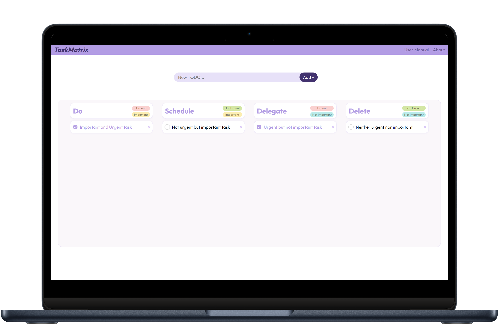

<p align="center">
   
</p>

[TaskMatrix](https://hdz-088.github.io/TaskMatrix/) is a Eisenhower Marix based to-do list website, made by using HTML, CSS and JS

## Demo

<p align="center">

</p>

## How to Use

- To use TaskMatrix Go to [TaskMatrix](https://hdz-088.github.io/TaskMatrix/)

## Installation

```bash
git clone https://github.com/hdz-088/TaskMatrix.git
```

## Contributing

Contributions are welcome! Please feel free to submit a Pull Request.

1. Fork the repository.
2. Create a new branch (git checkout -b feature-branch).
3. Make your changes.
4. Commit your changes (git commit -m 'Add some feature').
5. Push to the branch (git push origin feature-branch).
6. Open a Pull Request.

## 🫱🏻‍🫲🏻 Connect With Me

- Portfolio: <a href="https://hdzala.vercel.app/?ref=github">Portfolio</a>
- Other Projects: <a href="https://hdz-projectvault.vercel.app/">Project Vault</a>
- Email: <a href="mailto:hdz088@outlook.com">hdz088@outlook.com</a>
- Instagram: <a href="https://instagram.com/hdz_088">hdz_088</a>
- LinkedIn: <a href="https://linkedin.com/in/hdz088/">hdz088</a>

---
